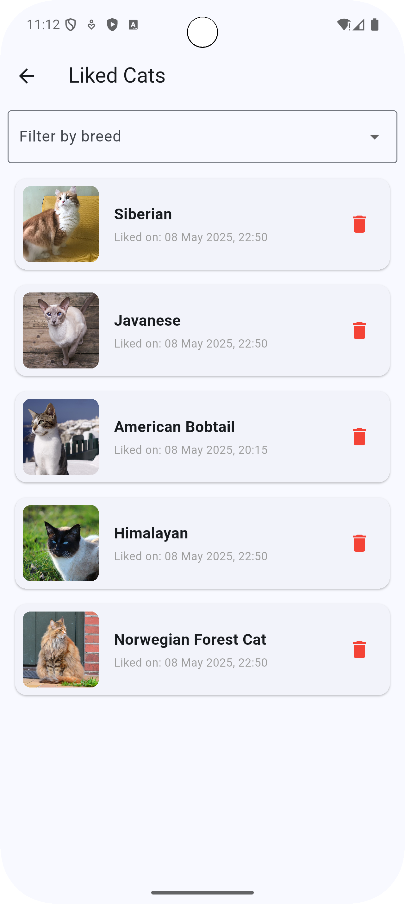

# Cat Swiper 🐱

**Cat Swiper** — это простое и увлекательное приложение для любителей котиков! Вам предоставляется возможность просматривать случайные изображения котиков, узнавать их породы и сохранять понравившиеся картинки. Приложение использует API [The Cat API](https://thecatapi.com) для получения данных о котиках.

---

**Что нового?**
- Добавлен список лайкнутых котиков
- В списке можно отфильтровать котов по породе 
- Так же можно увидеть дату лайка и удалить котика из списка
- **Оффлайн режим**: приложение работает даже без интернета!
- **Сохранение лайков**: все ваши лайки сохраняются между сессиями
- **Кэширование изображений**: изображения доступны даже без сети
- **Индикатор сети**: вы всегда знаете, работаете ли вы в оффлайн режиме

## 📱 Скриншоты приложения

| Главный экран | Детали породы | Понравившиеся коты | Оффлайн режим |
|---------------|---------------|-------------------|---------------|
|  |  |  |  |

---

## 🚀 Реализованные функции

- **Случайные котики**: На главном экране отображается случайное изображение котика и название его породы.
- **Свайп и кнопки**: Вы можете свайпнуть картинку влево или вправо, либо использовать кнопки "Лайк" и "Дизлайк" для перехода к следующему котику.
- **Счетчик лайков**: Приложение считает количество понравившихся котиков.
- **Список лайков**: Можно увидеть список всех понравившихся котиков с датой лайка и есть возможность фильтровать по породе.
- **Детальная информация**: При нажатии на изображение котика открывается экран с подробной информацией о породе.
- **Оффлайн режим**: Приложение работает даже без интернета, показывая ранее загруженных котиков.
- **Сохранение данных**: Все лайки сохраняются в локальной базе данных SQLite.
- **Кэширование изображений**: Изображения кэшируются и доступны без сети.
- **Индикатор сети**: Неблокирующее уведомление о статусе сети.

---

## 📥 Скачать APK

Скачайте последнюю версию приложения по ссылке:
[Cat Swiper APK](https://github.com/LidyOS/Cat-Swiper/releases/download/v2.0.0/cat_swiper_v2.0.0.apk) 

---

## 🛠 Технические детали

- **Язык программирования**: Dart
- **Фреймворк**: Flutter
- **Архитектура**: Clean Architecture с BLoC (Cubit)
- **Зависимости**:
    - `http`: Для работы с API
    - `cached_network_image`: Для кеширования и отображения изображений
    - `flutter_bloc`: Для управления состоянием
    - `sqflite`: Для локального хранения данных
    - `connectivity_plus`: Для проверки наличия сети
    - `get_it`: Для внедрения зависимостей
    - `equatable`: Для сравнения объектов
- **API**: [The Cat API](https://thecatapi.com)
- **Тестирование**: Unit-тесты для бизнес-логики с использованием mockito

---

## 🛠 Как запустить проект

1. Убедитесь, что у вас установлен Flutter. Если нет, следуйте [официальной инструкции](https://flutter.dev/docs/get-started/install).
2. Клонируйте репозиторий:
   ```bash
   git clone https://github.com/LidyOS/Cat-Swiper.git
   ```
3. Перейдите в папку проекта:
   ```bash
   cd Cat-Swiper
   ```
4. Установите зависимости:
   ```bash
   flutter pub get
   ```
5. Запустите приложение:
   ```bash
   flutter run
   ```

## 🧪 Запуск тестов

```bash
flutter test
```

## 🌟 Дополнительные функции

- **Темная тема**: Приложение автоматически адаптируется к системной теме устройства
- **Анимации**: Плавные переходы между экранами и анимации при взаимодействии с элементами интерфейса
- **Оптимизация производительности**: Эффективное использование ресурсов для быстрой работы даже на слабых устройствах

---

## 🤝 Контакты

Если у вас есть вопросы или предложения, свяжитесь со мной:  
📧 Email: osipchuk.ls@phystech.edu
🌐 GitHub: [LidyOS](https://github.com/LidyOS)
