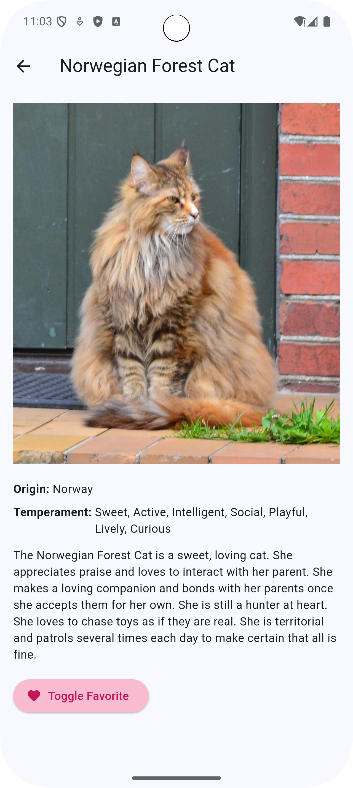

# Cat Swiper 🐱

**Cat Swiper** — это простое и увлекательное приложение для любителей котиков! Вам предоставляется возможность просматривать случайные изображения котиков, узнавать их породы и сохранять понравившиеся картинки. Приложение использует API [The Cat API](https://thecatapi.com) для получения данных о котиках.

---

## 📱 Скриншоты приложения

| Главный экран | Детали породы |
|---------------|---------------|
|  |  |

---

## 🚀 Реализованные функции

- **Случайные котики**: На главном экране отображается случайное изображение котика и название его породы.
- **Свайп и кнопки**: Вы можете свайпнуть картинку влево или вправо, либо использовать кнопки "Лайк" и "Дизлайк" для перехода к следующему котику.
- **Счетчик лайков**: Приложение считает количество понравившихся котиков.
- **Детальная информация**: При нажатии на изображение котика открывается экран с подробной информацией о породе.

---

## 📥 Скачать APK

Скачайте последнюю версию приложения по ссылке:
[Cat Swiper APK](https://github.com/LidyOS/Cat-Swiper/releases/download/android/app-release.apk) 

---

## 🛠 Технические детали

- **Язык программирования**: Dart
- **Фреймворк**: Flutter
- **Зависимости**:
    - `http`: Для работы с API.
    - `cached_network_image`: Для кеширования и отображения изображений.
- **API**: [The Cat API](https://thecatapi.com)

---

## 🛠 Как запустить проект

1. Убедитесь, что у вас установлен Flutter. Если нет, следуйте [официальной инструкции](https://flutter.dev/docs/get-started/install).
2. Клонируйте репозиторий:
   ```bash
   git clone https://github.com/LidyOS/Cat-Swiper.gitt
   ```
3. Перейдите в папку проекта:
   ```bash
   cd Cat-Swiper
   ```
4. Установите зависимости:
   ```bash
   flutter pub get
   ```
5. Запустите приложение:
   ```bash
   flutter run
   ```

---

## 🤝 Контакты

Если у вас есть вопросы или предложения, свяжитесь со мной:  
📧 Email: osipchuk.ls@phystech.edu
🌐 GitHub: [LidyOS](https://github.com/LidyOS)
